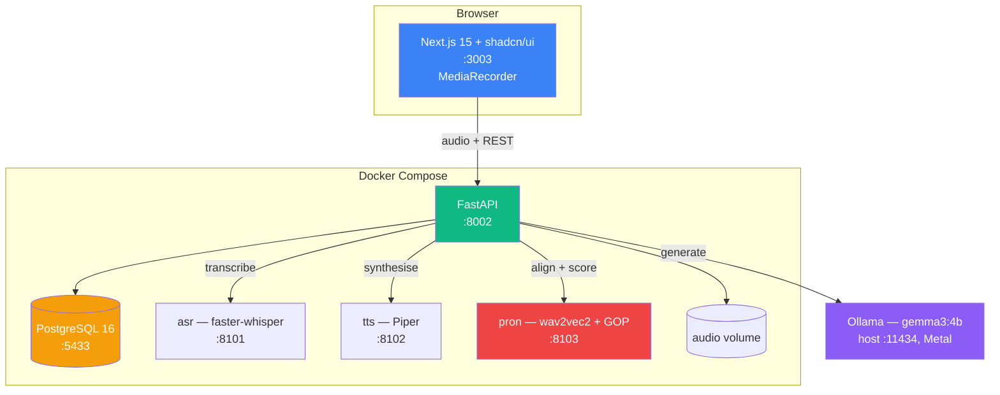

# SpeakLab — Product Requirements Document

**Status:** Draft v1.0 — analysis phase, nothing built
**Date:** 2026-08-29
**Owner:** Luis Cruz
**Repository:** `Luisfelipecruz/speaklab` (not yet created)

---

## 1. Summary

SpeakLab is a self-hosted application for **practising spoken English** that treats a
conversation as a *measurement instrument*, not just an interaction.

The user speaks — into a role-play scenario, or by reading a passage aloud. Every
utterance is transcribed, analysed, and reduced to a small set of **deterministic,
comparable numbers**. Those numbers accumulate. Six weeks later the user can point at a
chart and say *"my /θ/ went from 41% to 78%, and I stopped using past simple where
English wants present perfect."*

Everything runs locally: speech recognition, speech synthesis, the conversational model,
and the pronunciation scorer. No audio leaves the machine, and there is no per-minute API
bill to cap how much someone practises.

---

## 2. Problem statement

Three specific failures, in the order they bite.

### 2.1 Real scenarios cannot be rehearsed

You cannot practise a job interview by having a job interview. You cannot rehearse
explaining a production incident to a stakeholder until you are already doing it, badly,
in front of the stakeholder. Language classes substitute generic dialogue for the
specific, high-stakes situations that actually matter, and conversation partners are
expensive, scheduled, and reluctant to replay the same scene eight times.

### 2.2 Progress is invisible

A learner finishes a lesson with a vague sense that it went "okay". No one is counting.
Nobody can tell them whether their verb tenses are getting better or whether they have
simply learned to avoid the tenses they get wrong. Pronunciation feedback, when it comes
at all, arrives as *"try to soften that sound"* — unrepeatable, unquantified, and gone by
next week.

### 2.3 Without measurement there is no room for improvement

This is the one that matters. Deliberate practice needs a target and a signal. Absent
both, practice degrades into repetition: the learner rehearses what they can already do
and never finds the edge of what they cannot. SpeakLab exists to produce that signal.

---

## 3. Goals and non-goals

### 3.1 Goals

| # | Goal |
|---|---|
| G1 | Let a user hold a spoken, turn-based conversation with an AI persona inside a defined scenario, entirely offline |
| G2 | Let a user read a passage aloud and receive **per-phoneme** pronunciation scores |
| G3 | Record every utterance and derive deterministic metrics for fluency, grammatical accuracy, lexical/syntactic complexity, and pronunciation |
| G4 | Show trends over time per metric, so improvement or stagnation is visible rather than felt |
| G5 | Recommend the next scenario or passage from the user's own weakest measured areas |
| G6 | Run the entire stack via `docker compose up`, with local models only, on a developer laptop |
| G7 | Be a defensible portfolio artefact: a reviewer can read the code and see engineering judgement, not framework glue |

### 3.2 Non-goals

| # | Non-goal | Why |
|---|---|---|
| N1 | Certifying CEFR level | Certification requires calibrated human raters. SpeakLab reports a *band estimate* and labels it as such |
| N2 | Real-time barge-in / full-duplex voice | Turn-based is the honest fit for local models. Streaming is a documented later optimisation, not v1 |
| N3 | Teaching languages other than English | The phoneme set, G2P dictionary, and error taxonomy are English-specific by design |
| N4 | Multi-tenant SaaS, billing, teams | Single-user, self-hosted. Auth exists to scope data, not to sell seats |
| N5 | Mobile native apps | Responsive web. `MediaRecorder` works in mobile browsers |
| N6 | Beating commercial ASR accuracy | We use the best local model that fits the latency budget and report its measured WER honestly |

---

## 4. Target user

**Primary — "the plateaued professional."** A non-native speaker, roughly B1–B2, who
works in English daily and has stopped improving. They are understood at work, so nothing
forces correction, and their errors have fossilised. They have specific, recurring
situations they perform badly in (interviews, standups, negotiating, presenting) and no
way to rehearse them or to know whether they are getting better.

Their L1 shapes their errors. A Spanish speaker fights `/θ/`, `/v/`, `/z/`, the
`/ɪ/`–`/iː/` contrast, epenthetic `/e/` before initial `s`-clusters ("espeak"), and the
present-perfect/past-simple boundary — because Spanish maps those distinctions
differently. SpeakLab is built to notice exactly that kind of systematic, L1-driven pattern
rather than to flag isolated mistakes.

**Secondary — the portfolio reviewer.** An engineer or hiring manager who clones the repo
and runs it. They are a real user with real requirements: the stack must come up cleanly,
the README must be honest, and the interesting decisions must be findable and defended.

---

## 5. Product principles

These are load-bearing. Every design decision below traces back to one.

**P1 — Deterministic metrics for trends; the LLM only for explanation.**
Anything plotted on a chart is computed by code that produces the same number for the
same audio every time: word timestamps, pause ratios, phoneme posteriors, dependency
parses. An LLM writes the prose that explains a number to the user, and proposes error
labels that a rule layer then validates — but an LLM never *is* the metric. Prompt drift
must never look like progress.

**P2 — Never claim to have heard what we did not hear.**
Pronunciation claims come from acoustic models operating on the waveform. A model that
only ever saw a transcript may not comment on pronunciation, because from a transcript
it would be inventing. This is why the LLM-judge approach was rejected outright.

**P3 — Breadth and accuracy are separate axes.**
A learner can reach a zero error rate by only ever using the present simple. Measuring
error rate alone rewards avoidance. SpeakLab therefore measures **which** verb forms are
used (breadth) alongside **how correctly** (accuracy), and treats a narrowing repertoire
as a regression even when errors fall.

**P4 — A score without a baseline is noise.**
GOP scores move with microphone, room, and distance from the mic. Trends are computed
**within a user**, z-scored against that user's own rolling baseline, and no phoneme trend
is shown until it has at least 5 scored attempts behind it.

**P5 — Local first, and honest about the cost.**
Every model is local. Where that costs accuracy or latency versus a hosted API, the
README states the measured gap rather than hiding it.

---

## 6. Core experiences

### 6.1 Scenario conversation

The user picks a scenario — *Job interview, backend engineer* — and starts a session. An
AI persona opens in character. The user holds a button, speaks, releases. Roughly two to
three seconds later the persona replies in synthesised speech and the transcript appears.
The exchange continues until the scenario's goal is met or the user ends it.

A scenario is a first-class, seeded record, not a prompt string:

| Field | Purpose |
|---|---|
| `persona_prompt` | Who the AI is, its objective, and how hard it pushes |
| `goal` | The condition that marks the scenario complete |
| `target_grammar` | Forms the scenario is *designed to elicit* — e.g. `["present_perfect", "past_simple", "conditional_2"]` |
| `target_functions` | Communicative acts — e.g. `["describe_experience", "handle_objection"]` |
| `target_errors` | Kinds of mistake the scenario is *designed to draw out*, in the error taxonomy's category names — e.g. `["PREPOSITION"]`. Added in m14: `target_grammar` is in the parser's vocabulary, which has no word for an article or a false friend |
| `cefr_band` | Difficulty band used for filtering and recommendation |
| `rubric` | What a good performance looks like, used in the end-of-session report |

`target_grammar` is what closes the loop. The system can ask a question no simple chat
app can: *did this scenario actually make you produce present perfect, and were you right
when you did?* If a scenario never elicits its declared forms, the scenario is broken and
the eval harness in m11 says so.

Seed set at launch (8 scenarios): job interview, daily standup, sprint retrospective,
doctor's appointment, restaurant complaint, airport rebooking after a cancellation,
apartment viewing, explaining a technical incident to a non-technical stakeholder. Three
more were added in m14 for the mistakes those do not draw out: a lost property office
(articles), a courier who cannot find the door (prepositions) and an intake call for a
training programme (false friends).

**On ending a session** the user gets a report: what they did well, the errors grouped by
category with corrections, the forms they used, and the forms the scenario expected but
never got out of them. The transcript itself marks each correction on the words it is
about, once the report exists — the offsets every error carries are stored for that.

### 6.2 Read-aloud with pronunciation scoring

The user selects a passage, sees the text, and reads it aloud. The passage declares a
`phoneme_focus` — a set of target sounds it was written to exercise densely.

Scoring is asynchronous and runs the full pipeline:

```
audio ──► ffmpeg (16 kHz mono PCM)
      ──► faster-whisper ──────────────────► what was actually said
      ──► g2p over reference text ─────────► canonical phoneme sequence
      ──► wav2vec2 CTC phoneme posteriors
      ──► forced alignment (canonical vs frames)
      ──► GOP per phoneme ─────────────────► Postgres
```

**Goodness of Pronunciation** (Witt & Young, 2000), computed per aligned phone segment:

```
GOP(p) = log P(p | O_segment) − max over q in phone set of log P(q | O_segment)
```

Read plainly: *how much more confident is the acoustic model that this was the sound it
was supposed to be, than that it was the best competing sound?* A GOP near 0 means the
target sound won cleanly. A large negative GOP means something else won — and the
`recognized_phone` field records what, which is the difference between *"your /θ/ is
weak"* and *"you are producing /s/ where English wants /θ/."* The second is actionable.

The result surfaces as the passage text with each word tinted by its worst phone, a
per-phoneme table, and — critically — that phoneme's history for this user.

### 6.3 Progress

One page, four panels, all trend-first:

- **Fluency** — speech rate, articulation rate, pause ratio, mean length of run, filler rate
- **Accuracy** — errors per 100 words, stacked by taxonomy category, with verb tense broken out
- **Repertoire** — which verb forms were used, how often, how correctly (P3)
- **Pronunciation** — mean GOP per phone over time, worst phones surfaced first

Under each panel, one sentence of LLM-written prose interpreting the numbers, clearly
attributed as generated commentary rather than measurement (P1).

**Next up** recommends two items — one scenario, one passage — selected by a transparent,
rule-based score over the user's weakest categories, least-used verb forms, worst
phonemes, and time since last practised. The reason is always shown: *"picked because
your present perfect accuracy is 54% over the last 30 days."*

---

## 7. The measurement model

This section is the product. Everything else is delivery.

### 7.1 Fluency — from ASR word timestamps, deterministic

| Metric | Definition |
|---|---|
| Speech rate | words ÷ total turn duration, in wpm |
| Articulation rate | words ÷ phonated time, excluding pauses ≥ 250 ms |
| Pause ratio | silent time ÷ total time |
| Mean length of run | mean words between pauses ≥ 250 ms |
| Filler rate | fillers per 100 words (`um, uh, er, mm`, plus disfluent `like`, `you know`) |
| Response latency | ms from prompt end to first word |

Speech rate and articulation rate are kept apart on purpose. A learner who speeds up only
by pausing less has not improved their articulation; separating the two shows which is
actually moving.

### 7.2 Accuracy — error taxonomy

Fixed, closed taxonomy. The LLM proposes labels from this list and nothing else; anything
outside it is discarded. Closed vocabulary is what makes the categories comparable across
months (P1).

| Category | Representative subcategories |
|---|---|
| `VERB_TENSE` | `past_simple_for_present_perfect`, `present_perfect_for_past_simple`, `missing_past_marker`, `wrong_progressive_aspect`, `conditional_form`, `future_form`, `modal_form`, `reported_speech_backshift` |
| `SUBJECT_VERB_AGREEMENT` | `third_person_s`, `there_is_are`, `collective_noun` |
| `ARTICLE` | `missing_definite`, `missing_indefinite`, `superfluous`, `wrong_choice` |
| `PREPOSITION` | `wrong`, `missing`, `superfluous` |
| `WORD_ORDER` | `adverb_placement`, `question_inversion`, `adjective_order` |
| `NUMBER_COUNTABILITY` | `plural_marking`, `uncountable_pluralised`, `quantifier` |
| `PRONOUN` | `reference`, `case`, `omitted_subject` |
| `LEXICAL_CHOICE` | `false_friend`, `collocation`, `register_mismatch` |
| `OMISSION` | `missing_auxiliary`, `missing_copula` |

`false_friend` earns its own subcategory because it is the single highest-value signal
for a Spanish L1 speaker — *actually/currently*, *assist/attend*, *realise/notice*,
*sensible/sensitive*.

Every error record stores the character span, the original text, the correction, a short
explanation, the detector that found it (`llm` or `rule`), and a confidence. Errors below
a confidence threshold are stored but excluded from trend charts.

### 7.3 Complexity

| Metric | Definition |
|---|---|
| Mean length of utterance | words per user turn |
| MATTR | moving-average type–token ratio, window 50 |
| Subordination index | subordinate clauses ÷ total clauses, from the dependency parse |
| Verb-form repertoire | count of distinct tense/aspect/modality forms produced |

MATTR rather than raw type–token ratio, because raw TTR falls as sample length grows and
would show a learner getting "less varied" purely for talking more.

### 7.4 Pronunciation

| Metric | Definition |
|---|---|
| Phone GOP | per aligned phone instance, as in §6.2 |
| Phone accuracy | mean GOP per phone type, z-scored against the user's own baseline (P4) |
| Phone error rate | substitutions + deletions ÷ canonical phones |
| Confusion pairs | canonical → recognised, ranked — e.g. `/θ/ → /s/` ×34 |
| Word difficulty | words whose worst-phone GOP is lowest, ranked |

**L1-aware priors.** For a declared Spanish L1, these are watched from the first session
and surfaced even at low volume: `/θ/ /ð/ /v/ /z/ /ʃ/ /dʒ/ /h/`, the `/ɪ/`–`/iː/` and
`/æ/`–`/ɛ/` contrasts, epenthesis before initial `s`-clusters, and final-cluster
reduction. Priors change presentation order only — never the scores.

### 7.5 What SpeakLab deliberately does not claim

- **Not a CEFR certificate.** The band estimate is a heuristic over measured metrics, labelled as an estimate everywhere it appears.
- **GOP is relative, not absolute.** It is a comparison against competing phones under one acoustic model, not a verdict on intelligibility.
- **Single attempts are noisy.** No phoneme trend renders below 5 scored attempts (P4).
- **Recording conditions matter.** Device, sample rate, and estimated SNR are stored with every attempt; a device change is annotated on the trend chart rather than silently absorbed.
- **ASR errors propagate.** Whisper mistakes become false grammar errors. Measured WER on the golden set is published in the README, and turns whose ASR confidence falls below threshold are excluded from accuracy trends.

---

## 8. Functional requirements

Numbered, testable, and traceable to milestones in `speaklab-agent/IMPLEMENTATION-PLAN.md`.

### Accounts
- **FR-1** A user registers with email and password; passwords are stored Argon2-hashed.
- **FR-2** A user authenticates and receives a JWT scoping every subsequent request.
- **FR-3** A user declares native language and self-assessed level at registration; native language selects the L1 phoneme priors.
- **FR-4** All practice data is scoped to the owning user; no endpoint returns another user's data.

### Scenarios and conversation
- **FR-5** The system serves a filterable list of seeded scenarios with band, category, and target grammar.
- **FR-6** A user starts a session against a scenario; the persona produces the opening turn as text and audio.
- **FR-7** A user uploads a recorded audio turn; the system transcribes it, stores audio and transcript, and returns the persona's reply as text and audio.
- **FR-8** Conversation history is passed to the model within a bounded token budget, oldest turns summarised rather than dropped.
- **FR-9** A user ends a session and receives a report: strengths, errors with corrections, forms used, and declared target forms never elicited.
- **FR-10** A session survives a page reload; its transcript is retrievable in full.

### Read-aloud
- **FR-11** The system serves a filterable list of seeded passages with band and phoneme focus.
- **FR-12** A user records a reading; the system stores the audio and enqueues scoring.
- **FR-13** Scoring produces per-phoneme GOP, timing, and recognised phone for every canonical phone.
- **FR-14** Scoring produces a word-level rollup and a passage-level WER against the reference.
- **FR-15** Results are polled by the client and render as tinted passage text, a phoneme table, and per-phoneme history.
- **FR-16** A failed scoring job is retryable and surfaces its failure reason rather than hanging.

### Analysis
- **FR-17** Every user turn is parsed for deterministic grammar usage — tense, aspect, modality, clause structure.
- **FR-18** Every user turn is analysed for errors against the closed taxonomy of §7.2, with span, correction, explanation, and confidence.
- **FR-19** Proposed error labels outside the taxonomy are rejected, counted, and logged as a model-quality signal.
- **FR-20** Fluency metrics are computed from word timestamps for every user turn.

### Progress
- **FR-21** Daily and weekly rollups are computed per user across all four metric families.
- **FR-22** Trends are served over a configurable window with an explicit minimum-sample gate.
- **FR-23** Phoneme trends are z-scored against the user's own rolling baseline.
- **FR-24** The system recommends one scenario and one passage, and states the measured reason for each.
- **FR-25** A user can export their full history as JSON.

### Platform
- **FR-26** `docker compose up -d` brings up the full default stack with health checks passing.
- **FR-27** The API starts and serves non-speech endpoints while model services are still loading.
- **FR-28** Model weights persist in named volumes across image rebuilds.
- **FR-29** The API exposes OpenAPI documentation for every operation.

---

## 9. Non-functional requirements

### 9.1 Latency budget

Measured on the target machine (Apple M4 Max, 128 GB, 16 cores).

| Stage | Budget |
|---|---|
| Upload + ffmpeg decode | ≤ 200 ms |
| ASR (`small.en`, ~6 s of audio) | ≤ 700 ms |
| Grammar analysis (parallel with generation) | ≤ 400 ms |
| LLM reply (`gemma3:4b`, ~80 tokens, host Ollama on Metal) | ≤ 1500 ms |
| TTS (Piper) | ≤ 400 ms |
| **Conversational turn, p95** | **≤ 3000 ms** |
| Read-aloud scoring, async, p95 | ≤ 10 s |

Above roughly 4 seconds a turn stops feeling like conversation. If the budget cannot be
met, the fallbacks in priority order are: stream the LLM reply into TTS sentence by
sentence; drop ASR to `base.en`; shorten the reply token cap. Model size is reduced last.

### 9.2 Other

| Attribute | Requirement |
|---|---|
| Privacy | No audio, transcript, or metric leaves the machine. No telemetry. Enforced by having no outbound client in the code path |
| Resource ceiling | Default stack under 8 GB RSS with models warm, excluding host Ollama |
| Cold start | Full stack healthy within 5 minutes on first run, model downloads included |
| Storage | Audio retained by default; a retention setting can drop audio while keeping derived metrics |
| Accessibility | Keyboard-operable recording, captions on all synthesised speech, WCAG AA contrast |
| Browser support | Chrome, Edge, Safari 16+ — `MediaRecorder` with an Opus/WebM or MP4 fallback |
| Testing | pytest for API and services, Jest + RTL for frontend; the eval harness of m11 gates model-facing claims |

---

## 10. System architecture



### 10.1 Services

| Service | Image basis | Port | Profile | Why it is separate |
|---|---|---|---|---|
| `postgres` | `postgres:16.15` | 5433 | default | Plain Postgres. No PostGIS, no pgvector — nothing here needs them |
| `api` | python:3.12-slim | 8002 | default | FastAPI + async SQLAlchemy 2.0 + Alembic. Owns all orchestration; holds no model weights |
| `frontend` | node:24-alpine | 3003 | default | Next.js 15, React 19, shadcn/ui, Tailwind v4, installed with pnpm |
| `asr` | python:3.12-slim | 8101 | default *(`speech` until m4)* | faster-whisper on CTranslate2 — no torch. Stays light precisely because it is not in the API image |
| `tts` | python:3.12-slim | 8102 | default *(`speech` until m5)* | Piper, ONNX runtime, ~60 MB voices. Trivially small |
| `pron` | python:3.12-slim | 8103 | `pron` | ~2 GB of torch plus wav2vec2. Profiled so the stack is usable without it; read-aloud degrades to WER-only when it is down |
| `ollama` | `ollama/ollama` | 11434 | `llm` | **Not started by default.** Docker Desktop on macOS cannot pass the Apple GPU to a Linux guest, so a containerised Ollama runs CPU-only while the host's uses Metal. The API points at `host.docker.internal:11434`. The container definition exists for Linux hosts with a GPU and for CI |

Ports are offset from the other stacks on this machine so all of them run simultaneously.
The API is on **8002**, not 8001: 8001 was already bound by an unrelated stack when m1
was built. The offsets exist so several stacks coexist, and the other stacks move — check
with `lsof -nP -iTCP:<port> -sTCP:LISTEN` rather than trusting this table.

`asr` and `tts` are declared under `profiles: ["speech"]` from m1, because `docker-compose.yml`
lands whole in m1 and their build contexts do not exist until m4 and m5. A profiled service
is excluded from `build` as well as from `up`, which is what keeps a missing directory inert.
**m4 and m5 remove that profile** when they create the directories; `pron` keeps its own.

`api` deliberately declares **no `depends_on`** for `asr`, `tts`, or `pron`: it must start
and serve scenario browsing, history, and progress while models are still loading, and on
a machine where `pron` is never started at all (FR-27).

### 10.2 Repository layout

```
speaklab/
├── api/                    FastAPI — routers, models, db_models, services, tests
│   └── alembic/            migrations
├── frontend/               Next.js app router
├── infra/
│   ├── api/                Dockerfile + requirements.txt
│   ├── frontend/           Dockerfile
│   ├── asr/                Dockerfile + app.py
│   ├── tts/                Dockerfile + app.py
│   └── pron/               Dockerfile + app.py — alignment and GOP
├── seeds/                  scenarios.json, passages.json
├── eval/golden/            golden sets for the m11 harness
├── docs/                   architecture, data model, decision records
├── speaklab-agent/            PRD companion docs — plan, handoff, git sheet
├── docker-compose.yml
├── Makefile
└── README.md
```

---

## 11. Model choices

| Role | Choice | Rationale | Fallback |
|---|---|---|---|
| ASR | `faster-whisper small.en`, int8 | CT2 avoids torch entirely. Word-level timestamps and per-word logprobs are required by §7.1 and §7.5, and Whisper gives both | `base.en` if the latency budget is missed; `medium.en` for offline re-scoring |
| Conversation | `gemma3:4b` via host Ollama | Already pulled on this machine. 4B is the right size for a ≤1.5 s reply on Metal while holding a persona | `gemma3:12b` for quality on a slower budget; `mistral:7b` also present locally |
| TTS | Piper, `en_US-lessac-medium` | ONNX, CPU, faster than real time, ~60 MB. Naturalness is adequate for an interlocutor | Kokoro-82M if voice quality becomes the complaint |
| Phoneme acoustics | wav2vec2 CTC phoneme model | Frame-level phone posteriors are the only honest input to GOP | See §14 R1 — this is the de-risking target of the m0 spike |
| Forced alignment | `torchaudio.functional.forced_align` | CTC forced alignment in the stdlib of the framework already present. No Kaldi, no MFA install | Charsiu's frame classifier if the torchaudio path underperforms |
| G2P | `g2p_en` (CMUdict + neural fallback) | ARPAbet with stress; handles out-of-vocabulary words | `phonemizer`/espeak-ng for IPA if the phone set must match an IPA-trained model |
| Grammar parsing | spaCy `en_core_web_sm` | Morphological features (`Tense`, `Aspect`, `VerbForm`, `Mood`) and dependency labels give §7.3 and §7.1 without a model call |
| Error labelling | `gemma3:4b`, constrained JSON | Proposes labels only from the closed taxonomy; a rule layer validates spans and drops anything unmatched (FR-19) |

**Deliberately absent:** LangChain and LlamaIndex. The orchestration here is a handful of
HTTP calls and a token budget; a framework would hide the parts worth defending. Also
absent: any vector database. Nothing in this product is a retrieval problem.

---

## 12. Success criteria

SpeakLab v1 is done when all of the following are measured — not estimated — on the target machine.

| # | Criterion |
|---|---|
| S1 | `git clone`, `cp .env.example .env`, `docker compose up -d` reaches all-healthy with no manual editing |
| S2 | A complete 10-turn scenario conversation runs end to end, p95 turn latency ≤ 3 s |
| S3 | A read-aloud attempt returns per-phoneme GOP for every canonical phone within 10 s |
| S4 | GOP separates deliberately mispronounced from correctly pronounced recordings of the same passage, with the gap reported as a measured effect size |
| S5 | Error detection scores ≥ 0.70 precision on the golden set of hand-labelled turns |
| S6 | ASR WER on the golden read-aloud set is measured and published in the README |
| S7 | The progress page renders 30-day trends for all four metric families from ≥ 20 real sessions |
| S8 | Recommendations state a measured reason traceable to a stored metric |
| S9 | Test suite green in-container; count matches the README |
| S10 | Every claim in the README is counted against the live system, not recalled |

S4 and S5 are the ones that decide whether the product is real. A pipeline that runs
end to end but produces a GOP that does not distinguish good from bad speech has shipped
a plausible-looking number, which is worse than shipping nothing.

---

## 13. Data recorded

Product-level view; the physical schema lives in `speaklab-agent/IMPLEMENTATION-PLAN.md` §5.

| Entity | Holds |
|---|---|
| `users` | identity, native language, self-assessed band, retention preference |
| `scenarios` | persona, goal, target grammar and functions, band, rubric |
| `passages` | reference text, band, phoneme focus, word count |
| `sessions` | one practice sitting — user, scenario or passage, mode, timing, status |
| `turns` | one utterance — role, audio reference, transcript, ASR confidence, model, latency |
| `audio_assets` | path, duration, sample rate, format, sha256, device fingerprint |
| `attempts` | one read-aloud reading — passage, audio, transcript, WER, scoring status |
| `phoneme_scores` | canonical phone, recognised phone, word, timing, GOP, posterior |
| `language_errors` | span, category, subcategory, original, correction, explanation, detector, confidence |
| `grammar_usage` | deterministic per-turn counts of tense, aspect, modality, clause type |
| `fluency_metrics` | per-turn rate, articulation rate, pause ratio, MLR, filler count |
| `progress_snapshots` | daily and weekly per-user rollups across all four families |

Audio is stored on a named volume, referenced by path, never as a database blob.

---

## 14. Risks

| # | Risk | Impact | Mitigation |
|---|---|---|---|
| **R1** | **The GOP pipeline does not produce a usable signal.** Phone set mismatches between the G2P output and the acoustic model's inventory are the classic failure, and they degrade silently into plausible garbage | **Critical — invalidates §6.2 and G2** | Milestone **m0 is a throwaway spike** run before any production code: score a deliberately mispronounced recording against a clean one and require a measurable gap. If m0 fails, the fork to the ASR-diff heuristic is taken with the plan already written for it |
| R2 | ASR errors are attributed to the learner as grammar errors | Erodes trust fast | Per-word logprob gating; turns below the confidence threshold are excluded from accuracy trends (§7.5); WER published (S6) |
| R3 | Turn latency exceeds the conversational threshold | Product feels broken | Budget in §9.1 with an ordered fallback list; latency recorded per turn from m6 so regressions are visible, not felt |
| R4 | The LLM invents error categories or spans | Corrupts trends | Closed taxonomy, JSON-schema-constrained output, rule-layer span validation, out-of-taxonomy rejection counted as a quality metric (FR-19) |
| R5 | GOP varies with microphone and room, not with skill | Fake progress or fake regression | Within-user z-scoring, device fingerprint stored, minimum-sample gate, device change annotated on the chart (P4) |
| R6 | `pron` service memory pressure alongside Ollama | Stack unusable on smaller machines | `pron` is profiled and optional; read-aloud degrades to WER-only when absent; the target machine has 128 GB, but the README states the real floor |
| R7 | Scenario prompts drift out of character over a long conversation | Practice value collapses | Bounded history with summarisation (FR-8); persona re-anchored in the system message every turn; m11 evaluates persona adherence |
| R8 | Scope creep — this is a portfolio project with no deadline pressure | Never ships | m1–m12 are fixed and stacked; anything new lands in §15, not in a milestone |

---

## 15. Out of scope for v1

Recorded so they stay out of the milestones.

Streaming/full-duplex conversation · other target languages · native mobile apps ·
multi-user or teacher dashboards · a spaced-repetition vocabulary trainer · prosody and
intonation scoring beyond phone-level GOP · accent selection (GA vs RP) · user-authored
scenarios in the UI · CEFR calibration against human raters · cloud deployment.

### 15.1 Recorded after the milestones were fixed

Ideas that arrived once m1–m12 were built. Each is dated, and each stays here until a
milestone in the plan names it — recording is not scheduling.

| Date | Idea | Status |
|---|---|---|
| 2026-09-06 | **Corrections marked on the transcript.** The offsets every error carries were stored so the interface could underline the words, and no screen read them | Not a new idea; delivered as plan m13 |
| 2026-09-06 | **Grammar practice.** A rule-based detector for the categories a parse can decide, accuracy per grammatical form, a section that shows the learner's own corrected sentences, and one spoken drill — say the corrected sentence, scored by transcription | Scheduled as plan m14, after m13 and before polish |
| 2026-09-06 | **Seeds that elicit articles, prepositions and false friends**, and a CEFR band on every scenario and passage — the band filter currently filters on nothing | Delivered as plan m14 item 5: three scenarios, and `target_errors` to declare what they draw out. The band half was never true — every scenario and passage had one |
| 2026-09-12 | **Articulation: saying an idea clearly.** A timed spoken answer to a work prompt, with no persona. Code counts how the answer is built — signposted reasons, an example, a closing line, words per sentence, restarts — and how it was delivered, with the fluency measures of §7.1. A model explains what to change and says the speaker's own answer in fewer sentences, checked for anything the speaker never said; it is never the score (P1) and never comments on how the answer sounded (P2). Intonation and stress stay out, as §15 says | Built as plan m15, *Make your point* on screen, because "articulation rate" already names a speed measure. Each structure measure scored on held-out labelled answers before any screen showed it; restarts fell below the bar and are counted but not shown. The model's shorter version is withheld when it adds words the speaker never said. `docs/decisions/0019` |

---

## 16. Open questions

| # | Question | Needed by |
|---|---|---|
| Q1 | Does the wav2vec2 phone inventory align cleanly with `g2p_en` ARPAbet output, or is a hand-written mapping table required? | m0 |
| Q2 | What GOP threshold marks a phone "wrong" for a learner, and is it phone-specific? Likely calibrated from the m0 recordings rather than assumed | m8 |
| Q3 | Should conversation error analysis run inline (adds latency) or as a background job (report arrives late)? Leaning background, with the session report as the delivery point | m9 |
| Q4 | Is `gemma3:4b` strong enough for reliable constrained-JSON error labelling, or does that job need `gemma3:12b` while conversation stays on 4b? | m9 |
| Q5 | How many read-aloud attempts before a phoneme trend is statistically worth showing? §7.5 assumes 5 as a placeholder | m10 |

---

## 17. Companion documents

| Document | Contents |
|---|---|
| `speaklab-agent/IMPLEMENTATION-PLAN.md` | Milestones m0–m12, physical schema, API surface, per-milestone file lists and tests |
| `speaklab-agent/SESSION-HANDOFF.md` | Continuation plan — verified environment facts, decision log, resume-here checklist |
| `speaklab-agent/GIT-COMMANDS.md` | Every git and gh command to be executed manually |
