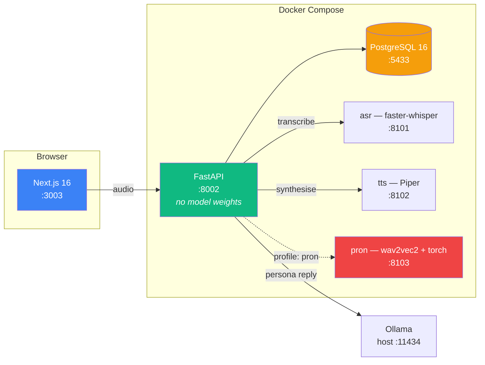

<div align="center">

# SpeakLab

**A speaking coach for English that runs entirely on your machine, and counts every number it shows you.**

[](https://github.com/Luisfelipecruz/speaklab/actions/workflows/ci.yml)
[](https://github.com/Luisfelipecruz/speaklab/releases/latest)
[](LICENSE)


[Site](https://luisfelipecruz.github.io/speaklab/) · [Quick start](#quick-start) · [Features](#features) · [Architecture](#architecture) · [Success criteria](#success-criteria) · [Limitations](#known-limitations) · [Docs](#documentation) · [Releases](https://github.com/Luisfelipecruz/speaklab/releases) · [Contributing](#contributing)

</div>


<sub>A correction exactly as the model proposed it: it fixed the verb and not the question — *how much does it cost* — and filed it under word order. That is why every correction is measured, and why detection stands at 0.500 precision, below its own bar.</sub>

Practise spoken English against models that run on your machine: a role-play with a persona who answers out loud, a passage read aloud and scored sound by sound, or a work question answered in one go.
Everything that moves on a chart is counted by code from what you said — the speed, the verb forms you used, each correction on the words it was about, how an answer was built — and a language model explains the numbers without ever producing one.
Nothing leaves the machine, and every figure here is measured and dated: [six of the ten success criteria are met](#success-criteria), three are not, and the tenth is the rule this file is written by.

---

## Features

- **Talk to a persona who answers out loud.** Eleven role-play scenarios, from an apartment
  viewing to a courier at your door. Hold to speak: Whisper writes it down, a local model
  answers in character, and Piper says the answer. When the conversation ends, each
  correction is marked on the words it was about.
- **Read a passage aloud and see it scored sound by sound.** Twelve passages, aligned
  against what you said and scored per phoneme — Goodness of Pronunciation, from an
  acoustic model that heard the waveform, not a language model reading a transcript.
- **Answer a work question in one go — *Make your point*.** Thirteen prompts. The reasons,
  examples, steps, contrasts and summing up in your answer are counted and marked on your
  words, with a model's notes and a shorter version of your own answer beside the counts.
- **See your grammar in your own sentences.** Every correction grouped by kind in the
  sentence you said it in; each verb form as a count — *right 9 of 13* — and never a
  percentage; any sentence said again and compared with what the recogniser heard.
- **Follow progress that refuses to overclaim.** One row per week, a hole with a reason
  where a week had too little speech, pronunciation as a distance from your own recent
  readings, and recommendations that print the measurement that chose them.
- **Keep your data.** Nothing leaves the machine, and your whole history exports as one
  JSON document.

---

## Why this is not another chat-with-an-AI app

Three things are load-bearing, and they are the reason the architecture looks the way it
does.

**Nothing on a trend chart is produced by a language model.** Word timings, pause ratios,
phoneme posteriors and dependency parses are computed by code that returns the same
number for the same audio every time. The LLM writes the sentence that explains a number
to you. It is never the number. Prompt drift must not be able to look like progress.

**No pronunciation claim comes from something that did not hear you.** Pronunciation is
scored by an acoustic model operating on the waveform — forced alignment and Goodness of
Pronunciation, not a language model reading a transcript and guessing. From a transcript,
it would be inventing.

**Breadth and accuracy are measured separately.** You can reach a zero error rate by only
ever using the present simple. So the system tracks *which* verb forms you use alongside
*how correctly*, and treats a narrowing repertoire as a regression even when errors fall.

---

## Quick start

**You need:**

| | |
|---|---|
| **Docker** | Docker Desktop, or Docker Engine with Compose **2.24 or later** (`docker compose version`) |
| **Ollama, on the host** | [ollama.com/download](https://ollama.com/download), then `ollama pull gemma3:4b` — 3.3 GB. It is deliberately not in Compose; [Architecture](#architecture) says why. Without it everything works except conversation |
| **Python 3, on the host** | For `make llm-check`, `make health` and `make eval`. The standard library is enough |
| **Disk** | Measured on 2026-09-12, tts, pron and the frontend on 2026-09-13: images of 826 MB (api), 790 MB (asr), 724 MB (tts), 1.06 GB (frontend) and 657 MB (`postgres:16.15`) — 4.1 GB — plus 464 MB of Whisper weights on first start, measured on 2026-09-10. `gemma3:4b` is 3.3 GB on top. Pronunciation scoring, which is optional, adds a 1.87 GB image and 1.2 GB of weights |
| **Memory** | **1.74 GiB** for the five containers after one conversation turn with both speech models loaded, sampled once with `docker stats` on 2026-09-12 — asr 673 MiB, frontend 613, tts 236, api 190, postgres 72; 1.94 GiB the first time, on 2026-09-10. Ollama is not in either figure. The requirement is under 8 GB (PRD §9) |

**Then:**

```bash
ollama pull gemma3:4b
make setup
```

`make setup` writes `.env` from `.env.example` if you have none, builds and starts the
five default containers, waits for them to report healthy, applies the migrations, loads
the 11 scenarios, 12 passages and 13 answer prompts, and finally asks the API whether it can reach Ollama with
the model pulled. The whole of what it runs is readable in the `Makefile`. Every step is
idempotent, so it is also the command to run after a `git pull`.

On a first run the recogniser is still downloading Whisper's weights for a few minutes
after `make setup` returns. Nothing waits for that — the API has no `depends_on` for the
recogniser, so the rest of the stack is usable immediately and `make health` reports `asr`
with `"model_loaded": false` until it is done.

**How long that takes.** Measured cold twice, each time from a copy of `main` with
empty volumes and a build cache of its own: `make setup` returned in **2 min 33 s** on
2026-09-12, with Whisper loaded at **2 min 43 s**, and in 7 min 12 s on 2026-09-10 on a
slower connection — nearly all of it the images downloading their dependencies.
[The first run](docs/measurements.md#the-first-run-measured-twice) has what each run did
and did not include.

The API signs sessions with a built-in development key until you set `JWT_SECRET`, and
says so in its startup log every time. That is fine on a laptop and nowhere else.

Then:

| | |
|---|---|
| App | <http://localhost:3003> |
| Sign up | <http://localhost:3003/register> |
| **Choose a scenario and talk** | <http://localhost:3003/scenarios> |
| Your conversations | <http://localhost:3003/sessions> |
| What the stack says about itself | <http://localhost:3003/status> |
| API docs | <http://localhost:8002/docs> |
| Can the API reach the conversation model? | `make llm-check` |
| Health | `make health` |
| Hear the voice | `make tts-sample` |
| Everything else | `make help` |

Open the app at **`localhost`**, not at a LAN address. Browsers only grant microphone
access on a secure origin, and `http://192.168.x.x:3003` is not one — the app detects this
and says so rather than rendering a record button that cannot work, but the fix is the URL.
Every port is bound to `127.0.0.1` anyway, so nothing here answers the network you are on.

The default stack is **five** containers: postgres, api, frontend, `asr` and `tts` — the
whole conversational stack — each service running as an unprivileged account, and a job
that runs first, hands the named volumes to that account, and exits. It does not start
`pron`, which keeps its profile permanently so that nobody downloads 1.87 GB of torch to
try a conversation. **`/health` reporting
`degraded` is the system working correctly** while `pron` is off: it names every service
it probed, and read-aloud still works in that state — a reading comes back with its
transcript and its word error rate, and says in words that the phone scores are missing
and how to get them (PRD R6). The Piper voice is inside its image, so the first thing the
system says out loud does not wait for a download.

For pronunciation scoring, `make pron-up` — 1.87 GB of image and 1.2 GB of weights,
measured at 109 s to first readiness including the download. Readings taken while it was
off can be scored afterwards without being read again (`FR-16`).

The long way, if you want each step separately: `cp .env.example .env`, `make up`,
`make migrate`, `make seed`, `make llm-check`.

### If something does not work

| Symptom | Cause, and the fix |
|---|---|
| Starting a conversation fails with "The conversation model is not available" or "not responding" | Ollama is not running, or the model is not pulled. `make llm-check` asks the API — not the host — and names the command that fixes it |
| `make llm-check` says unreachable on **Linux**, with Ollama running | Ollama listens on 127.0.0.1 by default, which a container cannot reach. Start it with `OLLAMA_HOST=0.0.0.0` — for the systemd service, `sudo systemctl edit ollama` and add `Environment="OLLAMA_HOST=0.0.0.0"`. That also exposes it to your network, so firewall port 11434 |
| No Ollama on the host at all | `make llm-up` runs it in a container instead, and tells you the one `.env` line that points the API at it. On macOS it runs on the CPU, several times slower |
| The first recording takes a long time, or reads as unavailable | The recogniser is still downloading its weights. `make health`, and wait for `asr` to report `"model_loaded": true` |
| A value changed in `.env` made no difference | The container that reads it was not recreated. `make restart` for the API, `make up` for the rest |
| The record button says the microphone is unavailable | You opened a LAN address. Use `http://localhost:3003` |

---

## Architecture



FastAPI is the only orchestrator. It normalises audio to 16 kHz mono PCM, calls `asr`
for a transcript with word timestamps and logprobs, computes the deterministic fluency
and grammar metrics in-process, calls Ollama for the persona's reply and `tts` for its
audio. Read-aloud takes a second path: the transcript plus a canonical phoneme sequence
from G2P go to `pron`, which force-aligns and returns per-phone GOP.

Three separate model services rather than one, and none of them inside the API image:

| | Runtime | Why separate |
|---|---|---|
| `asr` | faster-whisper on CTranslate2 | No torch. 790 MB image. Torch is not allowed in the request path |
| `tts` | Piper on onnxruntime | No torch either. 724 MB image around a 61 MB voice, 50× real time on CPU |
| `pron` | wav2vec2 + torch | **1.87 GB**. Its own profile, so the stack is usable by someone who never downloads it. torch comes from PyTorch's CPU index — from PyPI it was 8.51 GB, because those wheels pull the NVIDIA stack on arm64 too |

Ollama runs on the **host**, not in Compose. Docker Desktop on macOS cannot pass the
Apple GPU into a Linux container, so a containerised Ollama runs CPU-only while the
host's uses Metal — the same model, several times slower, for no benefit. The `ollama`
service is declared under `profiles: ["llm"]` for a Linux host with a GPU, and for CI.

What each part counts, and what it refuses to say — corrections, spoken answers, progress
and pronunciation — is in [docs/how-it-works.md](docs/how-it-works.md). Services, health,
audio and the conversation loop in depth: [docs/architecture.md](docs/architecture.md).

---

## Success criteria

The ten the PRD set before anything was built (§12), each with where it stands and what
settles it. S4 to S7 are re-measured by every `make eval` into
[docs/evaluation.md](docs/evaluation.md); the rest are measured by the command beside them.

| | Criterion | Where it stands | Settled by |
|---|---|---|---|
| S1 | A clean clone reaches all-healthy with no manual editing — within five minutes, model downloads included, by §9.2 | **Met** on 2026-09-12: `make setup` 2 min 33 s, Whisper loaded at 2 min 43 s. Missed on 2026-09-10 at 7 min 12 s — the same build on a slower connection | a cold copy of `main` and `make setup`; see [the first run](docs/measurements.md#the-first-run-measured-twice) |
| S2 | A whole conversation end to end, p95 turn latency ≤ 3 s | **Met** on a quiet machine: 2684 ms over 20 turns (2026-08-30). At a load average of 17, 5356 ms (2026-09-12) — a busy machine, recorded beside it | `make turn-latency` |
| S3 | A read-aloud attempt returns per-phoneme GOP within 10 s | **Met**: 250 sounds of a 34-second reading scored in 7.5 s (2026-09-12) | `make pron-golden` |
| S4 | GOP separates mispronounced from correct recordings of the same passage | **Never run.** It needs five minutes of a person's voice, following [the protocol](eval/golden/pron/README.md) | `make eval` |
| S5 | Error detection ≥ 0.70 precision on the hand-labelled turns | **Undecidable**: 0.500 over 6 scored proposals | `make eval` |
| S6 | ASR word error rate measured and published | **Met**: 1.72 % on ten LibriSpeech utterances | `make eval` |
| S7 | 30-day trends for all four families from ≥ 20 real sessions | **Not met**: 7 sessions, on 2 days | `make eval` |
| S8 | Recommendations state a measured reason traceable to a stored metric | **Met**: every recommendation prints the measurement that chose it; 15 tests | `api/tests/test_recommend.py`, in `make test` |
| S9 | The test suite is green in a container and its count matches the README | **Met**: 1 050 — 1 012 pass, 38 need a model service (2026-09-13) | `make test` |
| S10 | Every claim in the README is counted against the live system | **A rule, kept by practice**: every figure here is dated and names what produced it. Nothing tests prose | — |

S4, S5 and S7 wait on the same thing — speech only a person can produce, recorded on
several days — and no change to the code changes that. [What does not exist yet](docs/limitations.md)
says what each would take.

Every other figure, each with its date and what produced it, is in
[docs/measurements.md](docs/measurements.md).

---

## Known limitations

The full list is [docs/limitations.md](docs/limitations.md). The ones to know first:

- **Error detection is below its own bar.** 0.500 precision against 0.70, over six scored
  proposals — too few to decide the question either way. `gemma3:4b` finds roughly the
  right words and files them under the wrong category three times out of six.
- **A person's microphone has never been through the interface.** A synthetic voice played
  into a headless Chromium's microphone input has; the press on a real microphone, in
  Chrome and in Safari, needs a person.
- **Pronunciation has no calibrated pass mark, and S4 has never run.** Both need about five
  minutes of a person's voice, recorded to [the protocol](eval/golden/pron/README.md).
- **The progress page has little to show yet**: 7 sessions on 2 calendar days on the
  best-provisioned account, against a bar of 20.
- **Speech recognition misses its stage budget, on purpose**: 1231 ms against 700 ms for
  about six seconds of audio. `base.en` would meet it at 525 ms and cost 2.6× the word
  error rate; the whole turn meets its 3 s budget anyway.
- **Accounts are minimal**: no password reset, no email verification, no login rate
  limiting.

---

## Documentation

The same documents are a site, [luisfelipecruz.github.io/speaklab](https://luisfelipecruz.github.io/speaklab/),
rebuilt from `main` on every merge. Each [release](https://github.com/Luisfelipecruz/speaklab/releases)
carries its entry in the changelog as its notes.

| | |
|---|---|
| [docs/how-it-works.md](docs/how-it-works.md) | The conversation, corrections and grammar, read aloud, *Make your point*, progress and the evaluation harness — what each does, what it refuses to do, and how well it works |
| [docs/measurements.md](docs/measurements.md) | Every measured figure, by component, with what produced it |
| [docs/evaluation.md](docs/evaluation.md) | The report `make eval` writes, never edited by hand |
| [docs/limitations.md](docs/limitations.md) | What does not exist yet, by component |
| [docs/architecture.md](docs/architecture.md) | The services, health, data, audio and the conversation loop |
| [docs/data-model.md](docs/data-model.md) | The tables, why five columns are JSONB, and the seed contract |
| [docs/decisions/](docs/decisions/) | Why a choice was made: twenty-three dated records, each kept as it was written |
| [docs/changelog.md](docs/changelog.md) | One entry per milestone |
| [PRD.md](PRD.md) | The product requirements and the measurement model |
| [IMPLEMENTATION-PLAN.md](speaklab-agent/IMPLEMENTATION-PLAN.md) | How it was built: eighteen milestones, each with what it was expected to prove and what it measured |
| API reference | <http://localhost:8002/docs> once the stack is up: 31 operations, each with a summary |

---

## Development

Everything runs in containers. The host needs Docker, Python 3 for the `make` helpers, and
Ollama for conversation.

| | |
|---|---|
| API tests, in a container | `make test` — 1 050; 1 012 pass with Postgres alone, the other 38 need a model service |
| Frontend tests, in a container | `make test-frontend` — Jest and React Testing Library, 316 across 49 suites |
| Lint | `make lint` — ruff and black, check only; `make fmt` fixes in place |
| Dependencies and security | Pinned per service, and in `frontend/pnpm-lock.yaml`; Dependabot proposes updates weekly, for everything but the frontend, which CI audits every Monday; CI's Trivy job fails on a HIGH or CRITICAL vulnerability that has a fix — [CONTRIBUTING.md](CONTRIBUTING.md#dependencies) |
| Every measurement suite, into [docs/evaluation.md](docs/evaluation.md) | `make eval` — 15 min 20 s on 2026-09-13 with every service up |
| The project site, as Pages builds it | `make site` — its tests, then every page into `_site/`; a link to a file or a heading that does not exist fails it. `make site-serve` shows it |
| A release's notes | `make release-notes V=x.y.z` — that version's entry in the changelog; [CONTRIBUTING.md](CONTRIBUTING.md#releases) has how a release is cut |
| Every other target, described | `make help` |

### Repository layout

```
api/            FastAPI. No model weights, no torch.
  db_models/    SQLAlchemy — the write path, fourteen tables
  models/       Pydantic — the wire shapes
  routers/      One module per resource
  services/     Logic that is neither a route nor a row — the conversation, the analysers,
                the rollups, the export
  dependencies.py  current_user, and the ownership guard
  alembic/      Seven schema revisions, applied by `make migrate`
  scripts/      The seed loader, and the backfill, reparse, rollup and corpus commands
                behind `make`
  seeds/        The 11 scenarios, 12 passages and 13 answer prompts, as JSON
frontend/       Next.js 16, React 19, shadcn/ui, installed with pnpm
  src/app/      Routes. (auth) holds sign-in; (app) is the signed-in shell — home,
                scenarios, read, sessions, grammar, answers, progress — each page with a
                loading state of its own
  src/components/  The screens' parts, plus the shadcn primitives under ui/
  src/hooks/    useAuth (a provider), useRecorder (the microphone), useSession
  src/lib/      api.ts is the wire shapes and the browser client; server-api.ts forwards
                the cookie from a server component. Tests sit beside what they test
infra/          One directory per image — api, frontend, asr, tts, pron
eval/           The evaluation harness. run.py orchestrates, report.py adjudicates and
  golden/       renders, scoring.py is the arithmetic both share with the suites.
                golden/ holds the fixtures — committed, with a manifest of their hashes,
                and mounted read-only into the one container that measures
.github/        CI, the Pages and release workflows, Dependabot, and the issue and
                pull-request templates
docs/           Architecture, data model, decisions, changelog, and the evaluation report
website/        The project site's builder, and the script that cuts a release's notes
                from the changelog
speaklab-agent/ The implementation plan — how it was built
```

---

## Contributing

Contributions are welcome. [CONTRIBUTING.md](CONTRIBUTING.md) is short, and it explains the
one rule every change here keeps: a figure is measured, dated and named with what produced
it, or it is not written down.

**What this project needs most is not code.** Criterion S4 is measured on about five
minutes of a person reading three sentences twice, once naturally and once with marked
words said wrong — [the protocol](eval/golden/pron/README.md) — and nobody has recorded
them yet. A report of holding the record button on a real microphone, in Chrome or Safari,
is worth as much as a pull request.

Please follow the [code of conduct](CODE_OF_CONDUCT.md). Report a vulnerability as
[SECURITY.md](SECURITY.md) describes, not in a public issue.

---

## Acknowledgements

SpeakLab is built on other people's work:
[faster-whisper](https://github.com/SYSTRAN/faster-whisper), running Whisper `small.en`;
[Piper](https://github.com/rhasspy/piper) and its `en_US-lessac-medium` voice;
[wav2vec2](https://huggingface.co/facebook/wav2vec2-lv-60-espeak-cv-ft) through Hugging Face
Transformers, with [g2p_en](https://github.com/Kyubyong/g2p) and the CMU Pronouncing
Dictionary; [spaCy](https://spacy.io) and `en_core_web_sm`; [Ollama](https://ollama.com)
and Gemma 3; [FastAPI](https://fastapi.tiangolo.com),
[PostgreSQL](https://www.postgresql.org), [Next.js](https://nextjs.org) and
[shadcn/ui](https://ui.shadcn.com); and [LibriSpeech](https://www.openslr.org/12) for the
word-error-rate set.

## Licence

MIT. See [LICENSE](LICENSE).
