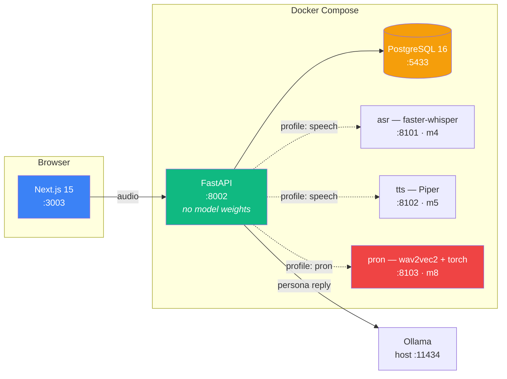

# SpeakLab

> Practise spoken English against local models. Scenario role-play, read-aloud
> pronunciation scoring with per-phoneme GOP, and progress you can actually measure.

Every model runs on your machine. Nothing is sent anywhere.

**Status: milestone 1 of 12 — the scaffold.** `docker compose up -d` brings up a healthy
three-container stack and a page that reports what is running. The conversation loop
arrives in m6 and pronunciation scoring in m8; see [What does not exist yet](#what-does-not-exist-yet),
which is most of it.

---

## Why this is not another chat-with-an-AI app

Three things are load-bearing, and they are the reason the architecture looks the way it
does.

**Nothing on a trend chart is produced by a language model.** Word timings, pause ratios,
phoneme posteriors and dependency parses are computed by code that returns the same
number for the same audio every time. The LLM writes the sentence that explains a number
to you. It is never the number. Prompt drift must not be able to look like progress.

**No pronunciation claim comes from something that did not hear you.** Pronunciation is
scored by an acoustic model operating on the waveform — forced alignment and Goodness of
Pronunciation, not a language model reading a transcript and guessing. From a transcript,
it would be inventing.

**Breadth and accuracy are measured separately.** You can reach a zero error rate by only
ever using the present simple. So the system tracks *which* verb forms you use alongside
*how correctly*, and treats a narrowing repertoire as a regression even when errors fall.

---

## Quick start

Prerequisites: Docker, and about 2 GB of disk for the images.

```bash
cp .env.example .env
make up
make migrate
make seed
```

`make seed` is idempotent — it keys on slug, and the second run reports
`0 inserted, 0 updated`. Running it after a `git pull` is how a content change reaches
your database.

The API signs sessions with a built-in development key until you set `JWT_SECRET`, and
says so in its startup log every time. That is fine on a laptop and nowhere else.

Then:

| | |
|---|---|
| App | <http://localhost:3003> |
| API docs | <http://localhost:8002/docs> |
| Sign up | <http://localhost:3003/register> |
| Scenarios | <http://localhost:8002/scenarios> |
| Passages | <http://localhost:8002/passages> |
| Health | `make health` |
| Tests | `make test` |
| Everything else | `make help` |

`make up` starts three containers. It does **not** start `asr`, `tts` or `pron` — those
are behind profiles, arrive in m4, m5 and m8, and the stack is designed to run without
them. `asr` and `tts` join the default stack when they are built; `pron` keeps its own
profile permanently, so nobody downloads two gigabytes of torch to try a conversation. `/health` reporting `degraded` today is the system working correctly, not a
misconfiguration.

---

## Architecture



FastAPI is the only orchestrator. It normalises audio to 16 kHz mono PCM, calls `asr`
for a transcript with word timestamps and logprobs, computes the deterministic fluency
and grammar metrics in-process, calls Ollama for the persona's reply and `tts` for its
audio. Read-aloud takes a second path: the transcript plus a canonical phoneme sequence
from G2P go to `pron`, which force-aligns and returns per-phone GOP.

Three separate model services rather than one, and none of them inside the API image:

| | Runtime | Why separate |
|---|---|---|
| `asr` | faster-whisper on CTranslate2 | No torch, ~400 MB. Torch is not allowed in the request path |
| `tts` | Piper on ONNX | ~60 MB per voice, CPU, faster than real time |
| `pron` | wav2vec2 + torch | ~2 GB. Its own profile, so the stack is usable by someone who never downloads it |

Ollama runs on the **host**, not in Compose. Docker Desktop on macOS cannot pass the
Apple GPU into a Linux container, so a containerised Ollama runs CPU-only while the
host's uses Metal — the same model, several times slower, for no benefit. The `ollama`
service is declared under `profiles: ["llm"]` for a Linux host with a GPU, and for CI.

---

## Measured

Counted against the running system on 2026-08-30, not recalled. Anything not listed here
has not been measured yet and is not claimed.

| | |
|---|---|
| Containers up and healthy | 3 of 3 |
| API test suite | 98 passed in 5.2–8.3 s |
| API image | 424 MB, with no torch — asserted by a test, not by a comment |
| API operations implemented | 11 of the 30 forecast |
| `GET /scenarios`, warm | 24 ms median |
| `GET /health`, warm | 45 ms median, ~30 ms of it three DNS failures for model services that do not exist yet |
| `POST /auth/register` | 61 ms median — one Argon2id hash at 64 MiB |
| Wrong password vs. unknown email | 75.6 vs 78.1 ms — the login endpoint does not reveal who has an account |

Latencies are medians over 12 calls on a laptop running several other stacks, and they
move by a factor of two or more with what else is busy. At m1 the same `/health` measured
13–20 ms. Treat them as orders of magnitude, not benchmarks; the ones worth reading are
the *ratios* — the register/login pair above is a claim about the code, and it holds
whatever the machine is doing.

### The pronunciation spike (m0)

Pronunciation scoring is the risky part of this product, so it was proved before anything
was built around it. On real human speech, GOP at a phone the speaker did not produce
fell by a mean of **8.14 nats** (Cohen's *d* = 8.26) against a threshold set at the 5th
percentile of correctly-produced GOP. **9 of 10** planted errors were detected and the
competing phone was named correctly in **10 of 10**. Cost: **99.5 ms** per attempt
against a 10-second budget.

The full writeup, including the failed first attempt and why it failed, is
`spike/gop-feasibility.md`. That directory is deliberately not committed; its findings
move into `docs/decisions/` at m8.

---

## What does not exist yet

Named explicitly so nothing here reads as a claim.

| Milestone | Not yet built |
|---|---|
| m3 | Password reset, email verification, login rate limiting — accounts themselves work |
| m4 / m5 | Speech in and speech out |
| m6 / m7 | The conversation loop, and a UI for it |
| m8 | Read-aloud and per-phoneme scoring — the spike passed, the service is not written |
| m9 | Error taxonomy and grammar analysis |
| m10 | Progress charts and recommendations |
| m11 | The evaluation harness |
| m12 | Documentation and a demo |

---

## Repository

```
api/            FastAPI. No model weights, no torch.
  db_models/    SQLAlchemy — the write path, twelve tables
  models/       Pydantic — the wire shapes
  routers/      One module per resource
  services/     Logic that is neither a route nor a row (hashing, tokens)
  dependencies.py  current_user, and the ownership guard
  alembic/      One revision per milestone that changes schema
  seeds/        The 8 scenarios and 12 passages, as JSON
frontend/       Next.js 15, React 19, shadcn/ui
infra/          One directory per image
docs/           Architecture, data model, decisions, changelog
speaklab-agent/ The twelve-milestone implementation plan
spike/          m0, throwaway, gitignored
```

The schema is documented in [docs/data-model.md](docs/data-model.md) — what each table
holds, why five columns are JSONB and two adjacent ones are not, and what the seed
contract is.

`PRD.md` holds the product requirements and the measurement model.
`speaklab-agent/IMPLEMENTATION-PLAN.md` holds the twelve milestones, the schema and the
API surface — including the ones not built yet, with what each is expected to prove.

## Licence

MIT. See [LICENSE](LICENSE).
